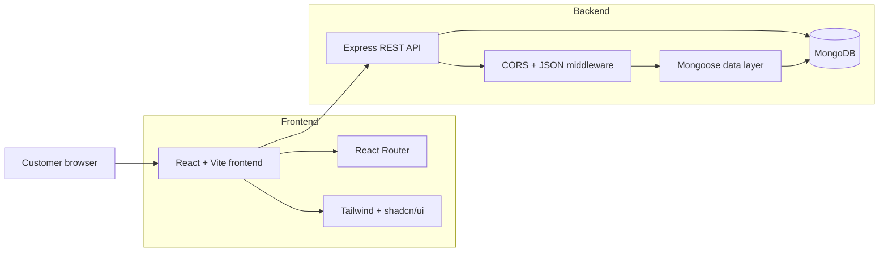

<div align="center">

# LetsEat.com

### A modern full-stack food discovery and ordering platform

[](https://react.dev/)
[](https://www.typescriptlang.org/)
[](https://expressjs.com/)
[](https://www.mongodb.com/)
[](https://tailwindcss.com/)
[](https://vite.dev/)

**LetsEat.com is a responsive MERN application being built to connect customers with local restaurants and provide a smooth online ordering experience.**

[Explore the code](https://github.com/engripaye/mern-food-ordering-app) · [Report an issue](https://github.com/engripaye/mern-food-ordering-app/issues)

</div>

---

## About the project

LetsEat.com is a full-stack portfolio project focused on the engineering behind a production-style food ordering platform. It combines a typed React client, a REST API built with Express, and MongoDB persistence in a clean frontend/backend repository structure.

The project currently includes its core application shell, responsive navigation, client-side routing, a reusable component system, backend middleware, and MongoDB connectivity. Ordering, restaurant management, authentication, and payment workflows are being developed incrementally.

## Current highlights

- Responsive desktop and mobile navigation
- Reusable UI primitives powered by shadcn/ui and Radix UI
- Type-safe React and Express codebases
- Client-side routing with fallback navigation
- Tailwind design tokens and a consistent Slate-based theme
- Express REST API foundation with JSON and CORS middleware
- MongoDB connection through Mongoose
- Separate development and production build workflows
- Strict TypeScript compilation and ESLint validation

## Technology stack

| Layer | Technologies |
| --- | --- |
| Frontend | React 19, TypeScript, Vite, React Router |
| Styling | Tailwind CSS, shadcn/ui, Radix UI, Lucide Icons |
| Backend | Node.js, Express 5, TypeScript |
| Database | MongoDB, Mongoose |
| Tooling | ESLint, PostCSS, Nodemon, ts-node |

## Architecture



## Project structure

```text
mern-food-ordering-app/
├── backend/
│   ├── src/
│   │   └── index.ts          # Express server and MongoDB connection
│   ├── package.json
│   └── tsconfig.json
├── frontend/
│   ├── src/
│   │   ├── components/       # Navigation and reusable UI components
│   │   ├── layout/           # Shared application layout
│   │   ├── lib/              # Shared utilities
│   │   ├── AppRoutes.tsx     # Client routes
│   │   ├── global.css        # Tailwind and theme tokens
│   │   └── main.tsx          # React entry point
│   ├── components.json       # shadcn/ui configuration
│   ├── package.json
│   └── vite.config.ts
└── README.md
```

## Getting started

### Prerequisites

- Node.js 20.19 or newer
- npm 10 or newer
- A local MongoDB instance or [MongoDB Atlas](https://www.mongodb.com/atlas) database

### 1. Clone the repository

```bash
git clone https://github.com/engripaye/mern-food-ordering-app.git
cd mern-food-ordering-app
```

### 2. Configure the backend

```bash
cd backend
npm install
```

Create `backend/.env`:

```env
MONGODB_CONNECTION_STRING=mongodb://127.0.0.1:27017/lets-eat
```

Start the API:

```bash
npm run dev
```

The backend runs at `http://localhost:7000`. Verify it with:

```bash
curl http://localhost:7000/test
```

Expected response:

```json
{
  "message": "Hello World"
}
```

### 3. Configure the frontend

Open a second terminal:

```bash
cd frontend
npm install
npm run dev
```

Open the local URL printed by Vite, normally `http://localhost:5173`.

## Available scripts

### Backend

| Command | Purpose |
| --- | --- |
| `npm run dev` | Start the API with automatic reloads |
| `npm run build` | Compile TypeScript into `dist/` |
| `npm start` | Run the compiled production server |

### Frontend

| Command | Purpose |
| --- | --- |
| `npm run dev` | Start the Vite development server |
| `npm run build` | Type-check and create a production build |
| `npm run lint` | Run ESLint across the frontend |
| `npm run preview` | Preview the production build locally |

## API reference

| Method | Endpoint | Description | Status |
| --- | --- | --- | --- |
| `GET` | `/test` | API health check | Available |

Additional restaurant, user, authentication, and order endpoints are planned as the backend domain is implemented.

## Roadmap

- [x] TypeScript frontend and backend foundations
- [x] MongoDB database connectivity
- [x] Responsive application header and mobile navigation
- [x] Shared layout and client-side routing
- [x] Tailwind and shadcn/ui component system
- [ ] User authentication and profile management
- [ ] Restaurant search and cuisine filters
- [ ] Restaurant owner dashboard and menu management
- [ ] Shopping cart and checkout workflow
- [ ] Secure payment integration
- [ ] Live order status tracking
- [ ] Automated unit, integration, and end-to-end tests
- [ ] CI/CD and cloud deployment

## Engineering goals

This project is being developed with an emphasis on:

- Clear separation between presentation, routing, API, and persistence concerns
- Reusable and accessible UI components
- Type safety across the full stack
- Responsive, mobile-first user experiences
- Small, reviewable feature increments
- Production-aware configuration and deployment practices

## Contributing

Suggestions and contributions are welcome. To propose a change:

1. Fork the repository.
2. Create a feature branch: `git checkout -b feature/your-feature`.
3. Commit your changes with a clear message.
4. Push the branch and open a pull request.

Please open an issue first for substantial architectural changes.

## Author

Built by **Engr. Ipaye** as a practical demonstration of modern full-stack JavaScript and TypeScript development.

- GitHub: [@engripaye](https://github.com/engripaye)
- Repository: [mern-food-ordering-app](https://github.com/engripaye/mern-food-ordering-app)

## License

This project is currently provided for portfolio and educational purposes. Add a project-level license before accepting external redistribution or commercial use.

---

<div align="center">
  <strong>If you find this project useful, consider giving it a star.</strong>
</div>
